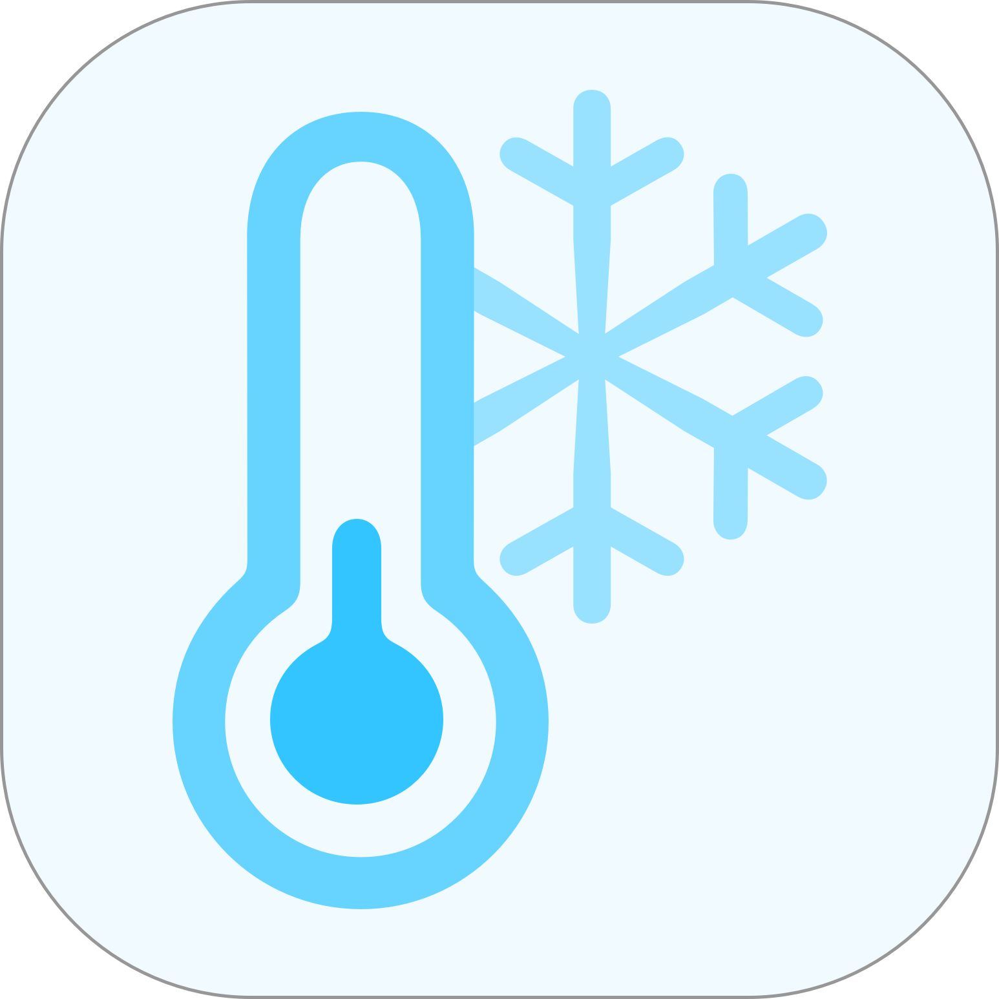

<p align="center"></p>

<p align="center">
<a href="https://packagist.org/packages/kurozora/laravel-cooldown"></a>
<a href="https://github.com/kurozora/laravel-cooldown/actions?query=workflow%3Arun-tests+branch%3Amaster"></a>
<a href="https://scrutinizer-ci.com/g/kurozora/laravel-cooldown"></a>
<a href="https://packagist.org/packages/kurozora/laravel-cooldown"></a>
<a href="https://developer.kurozora.app"><img src="https://img.shields.io/badge/Kurozora-Open%20Source-%23FF9300?style=flat&logo=data:image/svg+xml;base64,PD94bWwgdmVyc2lvbj0iMS4wIiBlbmNvZGluZz0iVVRGLTgiPz4KPHN2ZyB3aWR0aD0iMTEzOXB4IiBoZWlnaHQ9IjExODZweCIgdmlld0JveD0iMCAwIDExMzkgMTE4NiIgdmVyc2lvbj0iMS4xIiB4bWxucz0iaHR0cDovL3d3dy53My5vcmcvMjAwMC9zdmciIHhtbG5zOnhsaW5rPSJodHRwOi8vd3d3LnczLm9yZy8xOTk5L3hsaW5rIj4KICAgIDwhLS0gR2VuZXJhdG9yOiBTa2V0Y2ggNjQgKDkzNTM3KSAtIGh0dHBzOi8vc2tldGNoLmNvbSAtLT4KICAgIDx0aXRsZT5Mb2dvPC90aXRsZT4KICAgIDxkZXNjPkNyZWF0ZWQgd2l0aCBTa2V0Y2guPC9kZXNjPgogICAgPGRlZnM+CiAgICAgICAgPGZpbHRlciB4PSItNi4wJSIgeT0iLTUuNyUiIHdpZHRoPSIxMTIuMCUiIGhlaWdodD0iMTExLjUlIiBmaWx0ZXJVbml0cz0ib2JqZWN0Qm91bmRpbmdCb3giIGlkPSJmaWx0ZXItMSI+CiAgICAgICAgICAgIDxmZU9mZnNldCBkeD0iMCIgZHk9IjE2IiBpbj0iU291cmNlQWxwaGEiIHJlc3VsdD0ic2hhZG93T2Zmc2V0T3V0ZXIxIj48L2ZlT2Zmc2V0PgogICAgICAgICAgICA8ZmVHYXVzc2lhbkJsdXIgc3RkRGV2aWF0aW9uPSI5IiBpbj0ic2hhZG93T2Zmc2V0T3V0ZXIxIiByZXN1bHQ9InNoYWRvd0JsdXJPdXRlcjEiPjwvZmVHYXVzc2lhbkJsdXI+CiAgICAgICAgICAgIDxmZUNvbG9yTWF0cml4IHZhbHVlcz0iMCAwIDAgMCAwLjcxNzI3ODA4ICAgMCAwIDAgMCAwLjcxNDMzOTUzNiAgIDAgMCAwIDAgMC43MTQzMzk1MzYgIDAgMCAwIDEgMCIgdHlwZT0ibWF0cml4IiBpbj0ic2hhZG93Qmx1ck91dGVyMSIgcmVzdWx0PSJzaGFkb3dNYXRyaXhPdXRlcjEiPjwvZmVDb2xvck1hdHJpeD4KICAgICAgICAgICAgPGZlTWVyZ2U+CiAgICAgICAgICAgICAgICA8ZmVNZXJnZU5vZGUgaW49InNoYWRvd01hdHJpeE91dGVyMSI+PC9mZU1lcmdlTm9kZT4KICAgICAgICAgICAgICAgIDxmZU1lcmdlTm9kZSBpbj0iU291cmNlR3JhcGhpYyI+PC9mZU1lcmdlTm9kZT4KICAgICAgICAgICAgPC9mZU1lcmdlPgogICAgICAgIDwvZmlsdGVyPgogICAgICAgIDxsaW5lYXJHcmFkaWVudCB4MT0iNTAlIiB5MT0iOTkuNzg2MjEyJSIgeDI9IjUwJSIgeTI9IjAlIiBpZD0ibGluZWFyR3JhZGllbnQtMiI+CiAgICAgICAgICAgIDxzdG9wIHN0b3AtY29sb3I9IiNGRkZGRkYiIHN0b3Atb3BhY2l0eT0iMC41IiBvZmZzZXQ9IjAlIj48L3N0b3A+CiAgICAgICAgICAgIDxzdG9wIHN0b3AtY29sb3I9IiNGQ0ZDRkMiIG9mZnNldD0iMTAwJSI+PC9zdG9wPgogICAgICAgIDwvbGluZWFyR3JhZGllbnQ+CiAgICAgICAgPGxpbmVhckdyYWRpZW50IHgxPSItNC41NDQ0Mjk1MiUiIHkxPSItMzAuMzMwMTI3MyUiIHgyPSIxMjAuMTQ3MzI1JSIgeTI9IjEwNi42NDYxNTUlIiBpZD0ibGluZWFyR3JhZGllbnQtMyI+CiAgICAgICAgICAgIDxzdG9wIHN0b3AtY29sb3I9IiNGQUQ5NjEiIG9mZnNldD0iMCUiPjwvc3RvcD4KICAgICAgICAgICAgPHN0b3Agc3RvcC1jb2xvcj0iI0ZGOTMwMCIgb2Zmc2V0PSIxMDAlIj48L3N0b3A+CiAgICAgICAgPC9saW5lYXJHcmFkaWVudD4KICAgIDwvZGVmcz4KICAgIDxnIGlkPSJBcHAtSWNvbnMiIHN0cm9rZT0ibm9uZSIgc3Ryb2tlLXdpZHRoPSIxIiBmaWxsPSJub25lIiBmaWxsLXJ1bGU9ImV2ZW5vZGQiPgogICAgICAgIDxnIGlkPSJBcHAtSWNvbi1yb3VuZGVkIiB0cmFuc2Zvcm09InRyYW5zbGF0ZSgtMTg4NS4wMDAwMDAsIC02OTM1LjAwMDAwMCkiIGZpbGwtcnVsZT0ibm9uemVybyI+CiAgICAgICAgICAgIDxnIGlkPSJLdXJvem9yYS1EYXkiIHRyYW5zZm9ybT0idHJhbnNsYXRlKDE2ODYuMDAwMDAwLCA2NzQ0LjAwMDAwMCkiPgogICAgICAgICAgICAgICAgPGcgaWQ9IkxvZ28iIGZpbHRlcj0idXJsKCNmaWx0ZXItMSkiIHRyYW5zZm9ybT0idHJhbnNsYXRlKDIxNy4wMDAwMDAsIDE5My4wMDAwMDApIj4KICAgICAgICAgICAgICAgICAgICA8cGF0aCBkPSJNODcuOTgxODIyNyw2NzAuNjMyOTYgQzg3Ljg1MjMwMjYsNzg2LjE3NTcwMyAxMzYuODE2NzI0LDg5Ni4zMzMwODggMjIyLjY3MzkyLDk3My42NTUwNCBDMTM0Ljk3MjU5OSw4ODQuNzQ0NTYyIDEzMS4wODgzODIsNzQzLjEwODk2MiAyMTMuNzg0OTg2LDY0OS41MjU0ODkgQzI5Ni40ODE1OSw1NTUuOTQyMDE1IDQzNy41MTg3OTksNTQyLjM2ODY2MSA1MzYuNTQ1MTM1LDYxOC40NjMyMDQgQzYzNS41NzE0NzEsNjk0LjU1Nzc0OCA2NTguNzcwMjQ4LDgzNC4zMzQ1MjMgNTg5LjYzNDk2LDkzOC4zMzg4ODMgQzUyMC40OTk2NzIsMTA0Mi4zNDMyNCAzODIuNjM5NDU2LDEwNzUuMDU4NTQgMjc0LjE0NTI4LDEwMTMuMjA3MDQgQzM0MC4yMzAxMjcsMTA1Ni4xODA2OSA0MTcuMzkxNzAxLDEwNzguOTk2MTQgNDk2LjIyMDE2LDEwNzguODcxNTUgQzcyMS43NTEwNCwxMDc4Ljg3MTU1IDkwNC41MzUwNCw4OTYuMTAyNCA5MDQuNTM1MDQsNjcwLjYzMjk2IEM5MDQuNTM1MDQsNDQ1LjE2MzUyIDcyMS43NTEwNCwyNjIuMzk0ODggNDk2LjIyMDE2LDI2Mi4zOTQ4OCBDMjcwLjc2NjA4LDI2Mi4zOTQ4OCA4Ny45ODE4MjI3LDQ0NS4xNzg4OCA4Ny45ODE4MjI3LDY3MC42MzI5NiBaIiBpZD0iU2hhcGUiIGZpbGwtb3BhY2l0eT0iMC44NSIgZmlsbD0idXJsKCNsaW5lYXJHcmFkaWVudC0yKSI+PC9wYXRoPgogICAgICAgICAgICAgICAgICAgIDxwYXRoIGQ9Ik0xLjAyOTEwOTYxLDU5OS4xNjI4OCBDMS4wMjkxMDk2MSw2MzcuNjk3MjY0IDUuMDQyMjE2OTEsNjc2LjEyNjg3OSAxMy4wMjUyOCw3MTMuODI1MjggQzExLjA0NTkzNSw2OTUuODk2NDcyIDEwLjA1MTE2MTgsNjc3Ljg3MjYxNyAxMC4wNDU0NCw2NTkuODM0ODggQzEwLjA0NTQ0LDM4OS4wNTM0NCAyMjkuNTcwNTYsMTY5LjUyODMyIDUwMC4zNTIsMTY5LjUyODMyIEM3NzEuMTMzNDQsMTY5LjUyODMyIDk5MC42NTg1NiwzODkuMDk5NTIgOTkwLjY1ODU2LDY1OS44MzQ4OCBDOTkwLjY1ODU2LDkyMS4zODQ5NiA3ODUuODQ4MzIsMTEzNS4wODg2NCA1MjcuODc3MTIsMTE0OS4zNTgwOCBDNTM1LjgwMjg4LDExNDkuNjk2IDU0My43NTkzNiwxMTQ5LjkxMTA0IDU1MS43NzcyOCwxMTQ5LjkxMTA0IEM4NTUuOTA1MjgsMTE0OS45MTEwNCAxMTAyLjUxMDA4LDkwMy4zMzY5NiAxMTAyLjUxMDA4LDU5OS4xNjI4OCBDMTEwMi41MTAwOCwyOTQuOTg4OCA4NTUuOTM2LDQ4LjQzMDA4IDU1MS43NzcyOCw0OC40MzAwOCBDMjQ3LjY0OTI4LDQ4LjQzMDA4IDEuMDI5MTA5NjEsMjk1LjAwNDE2IDEuMDI5MTA5NjEsNTk5LjE2Mjg4IFoiIGlkPSJTaGFwZSIgZmlsbD0idXJsKCNsaW5lYXJHcmFkaWVudC0zKSI+PC9wYXRoPgogICAgICAgICAgICAgICAgICAgIDxwYXRoIGQ9Ik0wLDMzMC44OTc2OSBDNTMuMzY4MTYwMiwxNjcuMjYwNDk0IDIwMy4wNTU2NTksNTAuNDk5NzE1OSAzNjYuMjU1MDQsNC4yNjMyNTY0MWUtMTMgQzE3NC4zODYzMTQsNC4yNjMyNTY0MWUtMTMgMCwxMjMuMTAxNTUgMCwzMzAuODk3NjkgWiIgaWQ9IlNoYXBlIiBmaWxsPSIjRjlCNzRDIj48L3BhdGg+CiAgICAgICAgICAgICAgICA8L2c+CiAgICAgICAgICAgIDwvZz4KICAgICAgICA8L2c+CiAgICA8L2c+Cjwvc3ZnPg==" alt="Kurozora Open Source"></a>
</p>

<p align="center">
  <sup><em>plug-and-play global and model-specific cooldowns</em></sup>
</p>

# Laravel Cooldowns

This Laravel package makes it easier to implement cooldowns into your app.  
Consider the following example:
```php
// The user will be able to post again 5 minutes from now
$user->cooldown('create-post')->for('5 minutes');
```

## Installation

You can install the package via composer:

```bash
composer require kurozora/laravel-cooldown
```

## Usage
### Global cooldowns  
Global cooldowns aren't tied to any model and are the same throughout your entire app.  
Use the `cooldown` helper to create one:

```php
cooldown('registration')->for('1 hour');
```

Here's an example of how you could limit registration to once per hour:

```php
if(cooldown('registration')->notPassed())
    return 'Registration is currently unavailable.';

// ... perform account registration ...

cooldown('registration')->for('1 hour');
```

### Model-specific cooldowns
Of course, a more useful use-case would be to tie cooldowns to models. In order to make use of this, you'll need to add the trait to your model:

```php
use Illuminate\Database\Eloquent\Model;
use Kurozora\Cooldown\HasCooldowns;

class User extends Model
{
    use HasCooldowns;
}
```

The API used to interact with model-specific cooldowns is the exact same as global cooldowns, however you use the `cooldown` method on the model itself:  

```php
if($user->cooldown('create-post')->notPassed())
    return 'You cannot create a post right now.';

// ... create the post ...

$user->cooldown('create-post')->for('5 minutes');
````

### All cooldown methods
These methods are available for both global and model-specific cooldowns.

`for()` **Cooldown for a timespan**  
Pass along a string with the desired timespan.
```php
cooldown('create-post')->for('1 day 3 hours');
```

`until()` **Cooldown for a given datetime**  
Pass along a Carbon object with the desired datetime.
```php
$tomorrow = now()->addDay();

cooldown('create-post')->until($tomorrow);
```

`reset()` **Reset the cooldown**  
The cooldown will be reset, and the action will be available immediately.
```php
cooldown('create-post')->reset();
```

`passed()`  
Checks whether the cooldown has passed. Returns true if the cooldown hasn't ever been initiated.
```php
cooldown('create-post')->passed(); // true/false
```

`notPassed()`  
Checks whether the cooldown is still active, and thus hasn't passed yet.
```php
cooldown('create-post')->notPassed(); // true/false
```

`expiresAt()` **Get the expiration date**  
Returns the datetime at which the cooldown will pass.
```php
cooldown('create-post')->expiresAt(); // Illuminate\Support\Carbon object
````

`get()`  
Returns the underlying Cooldown model.
```php
cooldown('create-post')->get(); // Kurozora\Cooldown\Models\Cooldown object
````

### Testing

``` bash
composer test
```

## Contributing

Please see [CONTRIBUTING](CONTRIBUTING.md) for details.

### Security

If you discover any security related issues, please email kurozoraapp@gmail.com instead of using the issue tracker.

## Contributors ✨

Thanks goes to these wonderful people ([emoji key](https://allcontributors.org/docs/en/emoji-key)):

<!-- ALL-CONTRIBUTORS-LIST:START - Do not remove or modify this section -->
<!-- prettier-ignore-start -->
<!-- markdownlint-disable -->
<table>
  <tr>
    <td align="center"><a href="http://musa11971.me"><br /><sub><b>Musa</b></sub></a><br /><a href="https://github.com/Kurozora/laravel-cooldown/commits?author=musa11971" title="Code">💻</a> <a href="https://github.com/Kurozora/laravel-cooldown/commits?author=musa11971" title="Documentation">📖</a></td>
  </tr>
</table>

<!-- markdownlint-enable -->
<!-- prettier-ignore-end -->
<!-- ALL-CONTRIBUTORS-LIST:END -->

This project follows the [all-contributors](https://github.com/all-contributors/all-contributors) specification. Contributions of any kind welcome!

## License

The MIT License (MIT). Please see [License File](LICENSE.md) for more information.